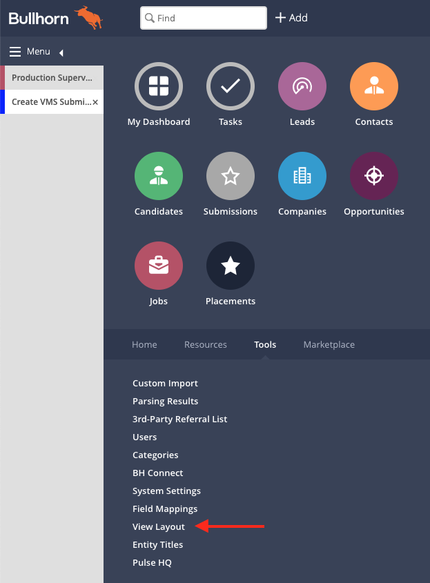
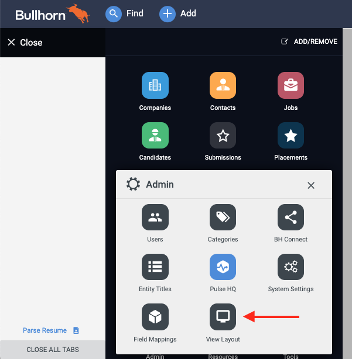

## Hello Card

The hello world of custom cards that shows the data passed from Bullhorn.

#### Prerequisites

 * [Host File Hack](../README.md) (One Time Only)

#### Install Dependencies

```npm
npm install
```

#### Start the App Locally

Start the auto-refreshing server that can be tested within Bullhorn as a custom card at `https://local.bullhornstaffing.com:4201/`:

```npm
npm start
```

#### View the App

Since we are matching the secure `https://` protocol of http://bullhornstaffing.com, we need to allow Chrome to open our app.

In a new browser card, navigate to `https://local.bullhornstaffing.com:4201` and when the page 
"Your connection is not private" is displayed, click the "Advanced" button. 


On the advanced page, click "Proceed to local.bullhornstaffing.com" to allow the browser to open the app.


You can now view your locally running custom extension from within Bullhorn. In a window outside of a Bullhorn extension,
you should see a screen that looks like this, since we check to see if Bullhorn has passed in query parameters to the extension.


#### Create Custom Card (Development Version) In Bullhorn

To integrate the custom card on any record, login to www.bullhornstaffing.com as an admin user 
and go to Main Menu -> View Layout.

For non Novo enabled users, it looks like this:



For Novo enabled users, it looks like this:



On the View Layout screen, select your entity of choice, then select Custom Cards 
and click the Add New button.


Select "Add New" and fill in the following details:

**Title:** Custom Card Dev

**URL:** https://local.bullhornstaffing.com:4201

**User Types:** (Novo Only) Include all user types that should have access to this card.


_For Custom Tabs Only: you may need to create an individual custom tab for each track (ex: Job 1 - Job V) 
in order to get the custom tab to show up on different entity tracks._

#### Build and deploy to cloud hosting

If using firebase, then the `package.json` deploy script is a handy way to build and deploy to firebase hosting in a single step. 
In order to do this, firebase hosting must first be setup for this project, by [Creating A Firebase Project](https://firebase.google.com).

```npm
npm run deploy
```
