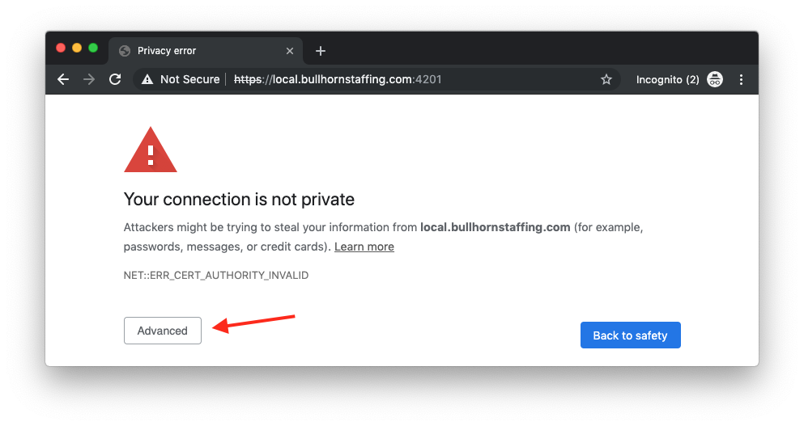
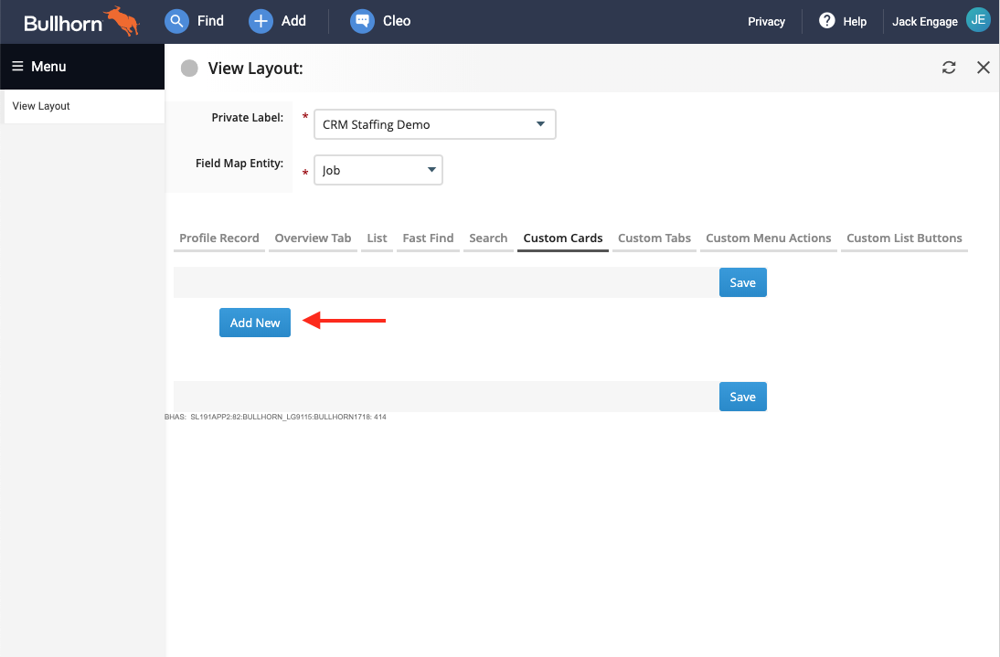
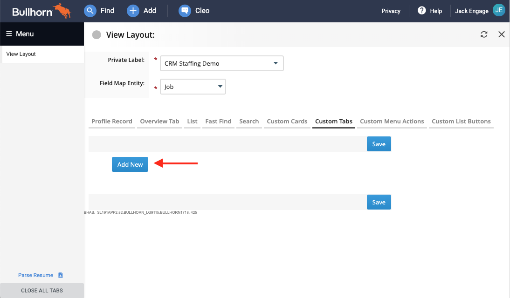
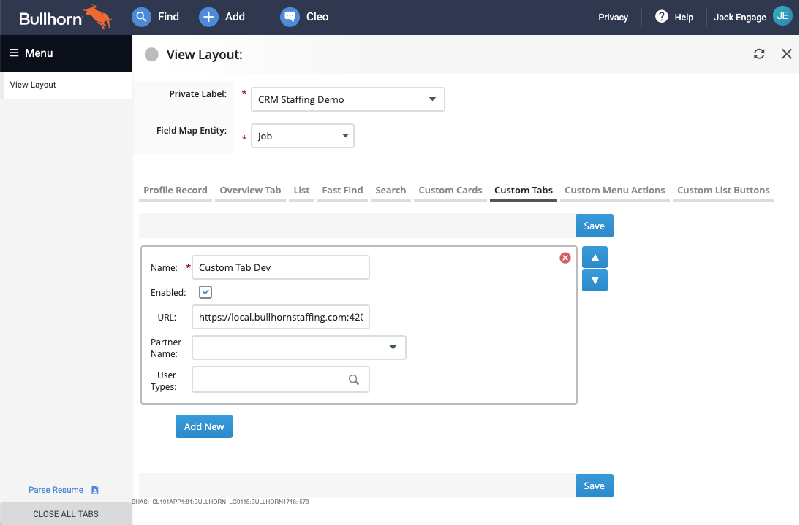

# Bullhorn Extension Samples

Bullhorn offers several ways to customize the recruiter experience with code using custom tabs, custom cards, custom record actions, custom list actions, and more. In this repo are several examples to get you started building custom extensions fast using [Novo Elements](https://github.com/bullhorn/novo-elements).

| Sample Name        | Description                                                                    | Readme     |
|--------------------|--------------------------------------------------------------------------------|------------|
|1.HelloCard         | The hello world of custom cards that shows the data passed from Bullhorn.      | [View][#1]
|2.HelloTab          | The hello world of custom tabs that shows the data passed from Bullhorn.       | [View][#2]
|3.HelloRecordAction | The hello world of custom record actions that shows how to connect to AppBridge as an action and see the data passed from Bullhorn. | [View][#3]
|4.HelloListAction   | The hello world of custom list actions that shows how to connect to AppBridge as an action and see the data passed from Bullhorn, which can include multiple entities selected from the list. | [View][#4]
|5.HelloMenuItem     | A placeholder for the hello world of custom menu items.                        | [View][#5]
|6.ComparisonCard    | A sample card for Job records that shows the current job compared to other jobs in a scatter plot. | [View][#6]
|7.ForecastCard      | A sample card for Job records that shows the current job compared to other jobs in a line chart forecasting into the future. | [View][#7]
|8.ScoreCard         | A sample card for Job records that shows the current job's score, a contrived score that is calculated by some  scoring criteria as well as an expander and a list view. | [View][#8]
|9.RelatedJobsTab    | A sample tab for Job records that shows all jobs in the same state in a list view with the preview slideout and open window calls to jump to another job. | [View][#9]
|10.CandidateEditTab | A sample tab for Candidate records that shows an edit form for specific fields as well as custom toasts and modal dialogs. | [View][#10]

[#1]:01.HelloCard
[#2]:02.HelloTab
[#3]:03.HelloRecordAction
[#4]:04.HelloListAction
[#5]:05.HelloMenuItem
[#6]:06.ComparisonCard
[#7]:07.ForecastCard
[#8]:08.ScoreCard
[#9]:09.RelatedJobsTab
[#10]:10.CandidateEditTab

### Prerequisites

 * [NodeJS](https://nodejs.org/en/) - version 10

 * Host File Hack (One Time Only)
 
     In order to dev test the custom action that is running locally from within Bullhorn 
     (which is running at https://bullhornstaffing.com) we must run a local server with https
     and match the domain. 

     Add the following line to your host file:

     ```
     127.0.0.1    localhost    local.bullhornstaffing.com
     ```

#### For Windows Users

 * Because this repo reuses the same shared files for each example project, symlinks are used to avoid duplication. See [this guide](https://www.joshkel.com/2018/01/18/symlinks-in-windows/) for configuring your windows machine to allow unix symlinks.
 * Alternatively, you can copy/paste the files from the shared folder to a sample extension, replacing the symlinks where needed.
 
### Testing Extensions Locally

Each extension can be locally served for development testing.

Since we are matching the secure `https://` protocol of http://bullhornstaffing.com, we need to allow Chrome to open our app.

In a new browser card, navigate to `https://local.bullhornstaffing.com:4201` and when the page 
"Your connection is not private" is displayed, click the "Advanced" button. 



On the advanced page, click "Proceed to local.bullhornstaffing.com" to allow the browser to open the app.


You can now view your locally running custom extension from within Bullhorn. In a window outside of a Bullhorn extension,
you should see a screen that looks like this, since we check to see if Bullhorn has passed in query parameters to the extension.


#### Add to Bullhorn for Development Testing

To integrate the custom card on any record, login to www.bullhornstaffing.com as an admin user 
and go to Main Menu -> View Layout.

For non Novo enabled users, it looks like this:


For Novo enabled users, it looks like this:


On the View Layout screen, select your entity of choice, then select your custom extension type of choice
and click the Add New button. 

Here is what it looks like for Custom Cards:



Here is what it looks like for Custom Tabs:



Select "Add New" and fill in the following details for a Custom Card:

**Title:** Custom Card Dev

**URL:** https://local.bullhornstaffing.com:4201

**User Types:** (Novo Only) Include all user types that should have access to this card.


Or for a Custom Tab:



_For Custom Tabs Only: you may need to create an individual custom tab for each track (ex: Job 1 - Job V) 
in order to get the custom tab to show up on different entity tracks._

#### Building and deploying to cloud hosting

If using firebase, then the `package.json` deploy script is a handy way to build and deploy to firebase hosting in a single step. 
In order to do this, firebase hosting must first be setup for this project, by [Creating A Firebase Project](https://firebase.google.com).

```npm
npm run deploy
```
